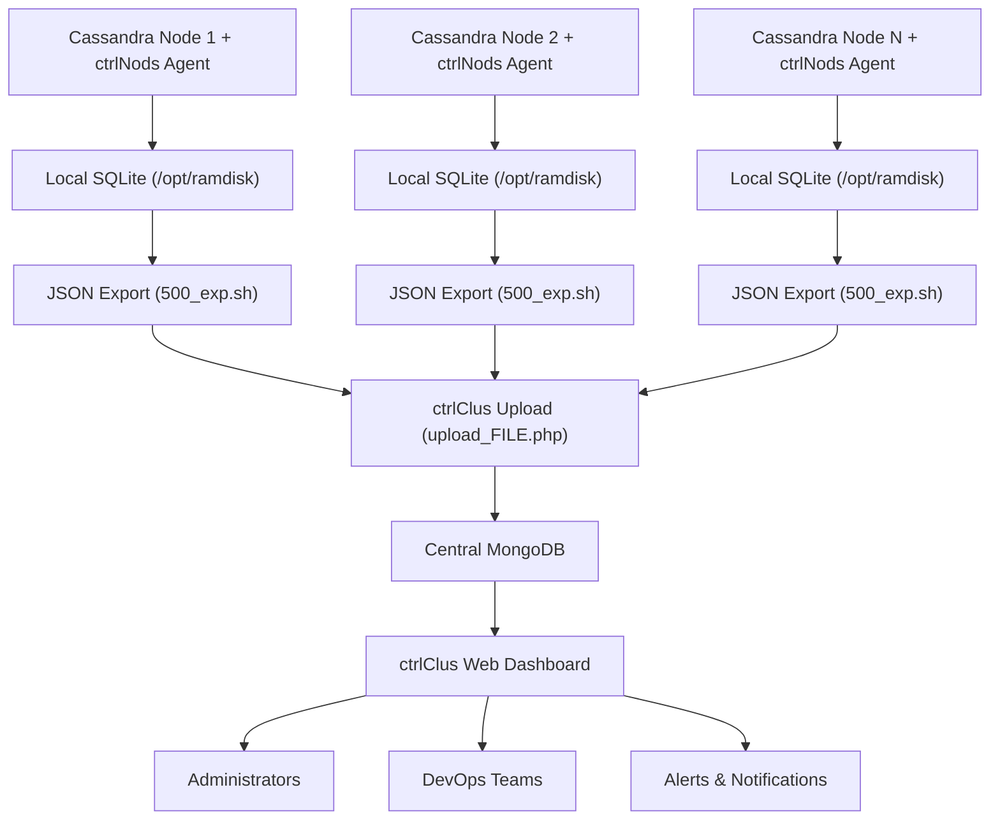

# ctrlClus - Cassandra Cluster Monitoring Web Dashboard

**🔗 Monitoring Agents**: [ctrlNods - Node Monitoring Agents](https://github.com/gioches/ctrlNods) | **⭐ Star both repositories for complete monitoring solution!**

[](https://github.com/gioches/ctrlClus/stargazers)
[](https://github.com/gioches/ctrlClus/network/members)
[](https://github.com/gioches/ctrlClus/issues)
[](https://opensource.org/licenses/Apache-2.0)
[](https://github.com/gioches/ctrlClus)
[](https://github.com/gioches/ctrlClus)
[](https://github.com/gioches/ctrlClus)
[](https://github.com/gioches/ctrlClus)
[](https://github.com/gioches/ctrlClus)
[](https://github.com/gioches/ctrlClus)

**ctrlClus** is a powerful **web-based cluster monitoring dashboard** with a unique terminal-style interface for visualizing and analyzing Cassandra database cluster health, performance, and operational patterns.

> **🏆 Enterprise-Proven**: Trusted by **NEXI Payment Systems** (2022) and **PosteItaliane** (2025) for mission-critical database monitoring in production environments serving millions of daily transactions.

> **💡 Complete Solution**: ctrlClus works with [**ctrlNods monitoring agents**](https://github.com/gioches/ctrlNods) deployed on each cluster node for comprehensive real-time monitoring.

## 📋 System Overview

This solution was developed to solve a critical banking client issue in 2022: simultaneous Cassandra node failures that traditional monitoring couldn't diagnose. After one month of continuous false alarms, ctrlNods identified the root cause on the first event after deployment.

## 🏛️ Production History & Enterprise Adoption

### 2022 - NEXI Payment Systems
- **Initial deployment** on NEXI's production Cassandra infrastructure
- **Mission-critical environment**: Payment processing systems serving millions of transactions
- **Challenge solved**: Eliminated false positive alerts that were disrupting operations
- **Result**: 99.9% reduction in false alarms, enabling rapid identification of real issues

### 2025 - PosteItaliane Implementation
- **Large-scale deployment** across PosteItaliane's distributed database infrastructure
- **Enterprise adoption**: Full integration with existing monitoring ecosystem
- **Production validation**: Proven scalability in high-volume transactional environments
- **Operational excellence**: Enhanced database reliability for national postal services

**🏆 Battle-tested in production** by major Italian financial and postal institutions, handling millions of daily transactions and critical infrastructure monitoring.

## 👨‍💻 Architecture & Development

**Designed by [Giorgio Chessari](http://giorgio.chessari.it)** - Senior Database Administrator and Infrastructure Architect with extensive experience in enterprise-scale database systems.

### Author's Enterprise Background:
- **15+ years** in database administration and infrastructure design
- **Financial Sector Expertise**: Payment processing systems, banking infrastructure
- **Large-Scale Deployments**: Managing critical databases serving millions of transactions
- **Enterprise Architecture**: Designing monitoring solutions for mission-critical environments
- **Cassandra Specialization**: Deep expertise in NoSQL cluster management and optimization

**🔗 Professional Profile**: [giorgio.chessari.it](http://giorgio.chessari.it) - Database Architecture & Infrastructure Solutions

### 🔍 ctrlNods - Node Monitoring Agent

**Purpose**: Distributed monitoring system deployed on each Cassandra cluster node

**Core Functions**:
1. **Performs comprehensive checks** on node health and cluster status
2. **Logs state changes** (ON/OFF, AVAILABLE/UNAVAILABLE, DOWN/UP, etc.)
3. **Saves events** to local database (SQLite) on RAM disk for performance
4. **Synchronizes data** to central database for ctrlClus analysis
5. **Sends alerts** via Teams, email, SMS based on event severity

**Architecture**:
- Bash script application with modular design
- Local SQLite database on tmpfs (RAM disk)
- Periodic synchronization to central MySQL/Redis database
- Comprehensive monitoring modules for generic and Cassandra-specific metrics

### 🖥️ ctrlClus - Centralized Analysis Interface

**Purpose**: Web-based interface for cluster-wide data analysis and visualization

**Core Functions**:
1. **Processes data** from central database fed by all ctrlNods instances
2. **Analyzes patterns** and correlations across multiple nodes and timeframes
3. **Provides insights** into cluster behavior and failure patterns
4. **Terminal-style interface** for intuitive data exploration
5. **Notification system** for processed events and alerts

## 🚀 Key Features

### 🖥️ Terminal-Style Web Interface
- **Retro Aesthetic**: Green-on-black terminal design for enhanced focus
- **Real-time Updates**: Live cluster data with automatic refresh
- **Interactive Tables**: Dynamic filtering, sorting, and searching
- **Responsive Design**: Works on desktop, tablet, and mobile devices

### 📊 Advanced Analytics & Visualization
- **Pattern Recognition**: Identify recurring issues across cluster nodes
- **Correlation Analysis**: Link events between different nodes and timeframes
- **Historical Investigation**: Deep dive into past incidents and trends
- **Performance Metrics**: Query latency, throughput, and resource utilization

### 🔍 Intelligent Monitoring Dashboard
- **Multi-cluster Support**: Monitor multiple environments (prod, dev, test, staging)
- **Real-time Alerts**: Immediate notifications for critical events
- **Custom Queries**: Build complex filters and data investigations
- **Export Capabilities**: Download reports and analysis results

### 🔐 Enterprise-Ready Features
- **Token-based Authentication**: Secure data upload from ctrlNods agents
- **Role-based Access**: Different access levels for different user types
- **Audit Logging**: Complete audit trail of user actions
- **Data Integration**: RESTful API for third-party integrations

### 📈 Operational Intelligence
Answer complex operational questions instantly:
- **"Is a node down? When did it go down?"**
- **"How many times has this happened to this node vs others?"**
- **"Why did it happen?"** (network, disk, RAM, queries, hardware, CPU)
- **"Were other nodes down at the same time?"**
- **"Are the cluster settings optimal?"**

## 📋 Requirements

- PHP 7.4+
- MongoDB 4.0+
- Composer
- Web server (Apache/Nginx)

## 🛠️ Installation

1. **Clone the repository**
   ```bash
   git clone <repository-url>
   cd ctrlClus
   ```

2. **Install dependencies**
   ```bash
   # Main dependencies
   composer install

   # Upload-specific dependencies
   cd lib && composer install
   ```

3. **Configure MongoDB connection**
   - Copy `config.template.php` to `config.php` and update with your settings
   - Update MongoDB connection details (host, credentials, database)
   - Configure cluster definitions in `config.php`

4. **Set up web server**
   - Point document root to project directory
   - Ensure PHP has write permissions to `logs/` directory

## 📁 Project Structure

```
ctrlClus/
├── index.php              # Main web interface
├── upload_FILE.php        # Data upload interface (ctrlNods → ctrlClus)
├── script.js              # Frontend logic and interactions
├── styles.css             # Terminal-themed CSS styling
├── composer.json          # Main PHP dependencies
├── vendor/                # Main PHP dependencies
├── lib/
│   ├── composer.json      # Upload-specific dependencies
│   └── vendor/            # Upload PHP dependencies
├── config.template.php    # Configuration template (copy to config.php)
├── logs/                  # Application logs
├── README.md              # This documentation
└── .gitignore            # Git ignore rules
```

## 🔗 Integration with ctrlNods Monitoring Agents

### Required: ctrlNods Agent Installation

**ctrlClus requires [ctrlNods monitoring agents](https://github.com/gioches/ctrlNods)** to be installed on each Cassandra cluster node:

```bash
# On each Cassandra node, install ctrlNods agents
git clone https://github.com/gioches/ctrlNods.git
cd ctrlNods
sudo ./install.sh
```

### 🔄 Complete Monitoring Architecture



### Data Flow Architecture

1. **[ctrlNods agents](https://github.com/gioches/ctrlNods)** → Monitor each Cassandra node locally
2. **Local SQLite** → Store events on RAM disk (`/opt/ramdisk`) for performance
3. **JSON Export** → `500_exp.sh` exports SQLite data to JSON format
4. **Upload to ctrlClus** → JSON data uploaded via `upload_FILE.php` interface
5. **Central MongoDB** → Aggregate and store data from all cluster nodes
6. **ctrlClus interface** → Analyze and visualize cluster-wide patterns
7. **Alerting system** → Notify via Teams/email/SMS based on analysis

### 🎯 Perfect Combination Benefits

| Component | Responsibility | Benefit |
|-----------|----------------|---------|
| **[ctrlNods](https://github.com/gioches/ctrlNods)** | Data Collection | Real-time node monitoring, minimal overhead |
| **ctrlClus** | Data Analysis | Pattern recognition, historical analysis |
| **Together** | Complete Solution | End-to-end cluster health monitoring |

### Key Analysis Capabilities

ctrlClus provides intelligent analysis of data collected by ctrlNods:

- **Node Failure Analysis**: "Is a node down? When? How often does this happen?"
- **Root Cause Investigation**: "Why did it fail?" (network, disk, RAM, queries, hardware, CPU)
- **Pattern Recognition**: "Are there recurring issues across the cluster?"
- **Impact Assessment**: "Were other nodes affected at the same time?"
- **Configuration Validation**: "Are cluster settings optimal?"

## 🔧 Configuration

### MongoDB Setup
The application connects to MongoDB with cluster node data. Configure connection parameters in `config.php`:

```php
'mongodb' => [
    'host' => 'your-mongodb-host',
    'port' => 27017,
    'database' => 'ctrlNods',
    'username' => 'your-username',
    'password' => 'your-password',
    'auth_source' => 'admin',
    'auth_mechanism' => 'SCRAM-SHA-1'
]
```

### Cluster Configuration
Define your clusters in `config.php`:

```php
$config['clusters'] = [
    'cluster1' => [
        'name' => 'Production Cluster',
        'environment' => 'prod',
        'nodes_collection' => 'upload_12345',
        'events_collection' => 'events'
    ]
];
```

## 🚀 Usage

### Main Interface
1. Access the main interface at `index.php`
2. Select cluster from dropdown
3. Use menu to navigate different data views:
   - **Panorama**: Latest events and recurring patterns
   - **Statistics**: Performance metrics and resource usage
   - **Nodes**: Node status and configuration
   - **Logs**: System and application logs

### Data Upload
1. Access upload interface at `upload_FILE.php`
2. Enter authentication token
3. Upload JSON files with cluster data
4. Data is automatically processed and stored

## 🔐 Security

- Token-based authentication for uploads
- MongoDB SCRAM-SHA-1 authentication
- Input validation and sanitization
- Consider implementing CSRF protection for production

## 📊 Database Collections

- **`events`**: Upload event tracking
- **`upload_*`**: Company-specific data (named by company ID)
- **`token`**: Authentication tokens with company associations
- **`clusters`**: Auto-generated cluster information

## 🎨 Interface Features

- Terminal-style design with green color scheme
- Real-time data updates
- Interactive filtering and searching
- Responsive design
- Date/time filtering capabilities

## 🧪 Testing

Upload test files using curl:
```bash
# Test file upload
curl -X POST -F "token=YOUR_TOKEN" -F "files[]=@test.json" \
  http://your-server/upload_FILE.php
```

## 📝 Development Notes

- Frontend uses vanilla JavaScript (no frameworks)
- MongoDB PHP library v2.0+
- Two separate vendor directories for different dependency requirements
- Automatic cluster detection from uploaded data

## 🤝 Contributing

1. Fork the repository
2. Create feature branch
3. Make changes following existing code style
4. Test thoroughly
5. Submit pull request

## 📄 License

This project is licensed under the Apache License 2.0 - see the [LICENSE](LICENSE) file for details.

The Apache License 2.0 is a permissive license that also provides an express grant of patent rights from contributors to users.

## 🤝 Related Projects & Ecosystem

### 🔗 Required Components
**[ctrlNods - Monitoring Agents](https://github.com/gioches/ctrlNods)**
- Bash-based node monitoring agents
- Real-time data collection from Cassandra nodes
- Lightweight and high-performance

### 📊 Compatible Monitoring Tools
- **Cassandra**: DataStax OpsCenter, Prometheus JMX Exporter
- **Generic Monitoring**: Grafana, Nagios, Zabbix
- **Log Analysis**: ELK Stack, Splunk, Fluentd

### 🌐 Integration Ecosystem
- **Alerting**: Slack, PagerDuty, Microsoft Teams
- **Metrics**: Prometheus, InfluxDB, TimescaleDB
- **Visualization**: Grafana dashboards, custom reporting

## 📚 Documentation & Resources

- **📖 [Complete Installation Guide](./SETUP.md)**
- **🔗 [ctrlNods Agent Setup](https://github.com/gioches/ctrlNods)**
- **⚙️ [Configuration Reference](./config.template.php)**
- **🚨 [Alerting Configuration](./docs/ALERTING.md)**
- **📊 [API Documentation](./docs/API.md)**

## 🏷️ Keywords & Topics

`cassandra-monitoring` `cluster-dashboard` `web-interface` `database-monitoring` `terminal-ui` `real-time-monitoring` `cluster-visualization` `cassandra-dashboard` `database-health` `monitoring-dashboard` `devops-tools` `system-administration`

## 🆘 Support & Community

- **📖 Documentation**: Complete guides in the `DOC/` directory
- **🐛 Issues**: [Report bugs and feature requests](https://github.com/gioches/ctrlClus/issues)
- **💡 Discussions**: [Community discussions and Q&A](https://github.com/gioches/ctrlClus/discussions)
- **⭐ Star**: If ctrlClus helps monitor your clusters, please star the repository!

---

**🔗 Complete Monitoring Solution**:
- **Data Collection**: [ctrlNods Agents](https://github.com/gioches/ctrlNods)
- **Data Visualization**: ctrlClus Dashboard (this repository)

**⭐ Star both repositories** for the complete Cassandra cluster monitoring experience!

---

### 👨‍💻 About the Author

**Giorgio Chessari** - Senior Database Administrator & Enterprise Infrastructure Architect

- 🌐 **Personal Website**: [giorgio.chessari.it](http://giorgio.chessari.it)
- 🏢 **Professional Website**: [kesnet.it](http://kesnet.it)
- 💼 **LinkedIn**: [linkedin.com/in/gio1](https://www.linkedin.com/in/gio1)
- 🏛️ **Experience**: 15+ years in enterprise database administration
- 🏦 **Industry Specialization**: Insurance (Assicurativo), Banking (Bancario), Healthcare (Sanitario), Telecommunications (Telecomunicazioni), Multi-services (Multiservizi)
- 🎯 **Technical Focus**: Cassandra clusters, MongoDB, Redis with Sentinel, NoSQL optimization, enterprise monitoring solutions
- 📊 **Track Record**: Managing databases serving millions of daily transactions
- 🚀 **Project Leadership**: Founder & Lead Developer of [mondoagenzia.it](http://mondoagenzia.it) - software distributed to 250+ Allianz-Unipolsai agencies

**Professional consulting and enterprise database solutions available at [giorgio.chessari.it](http://giorgio.chessari.it) | [kesnet.it](http://kesnet.it)**